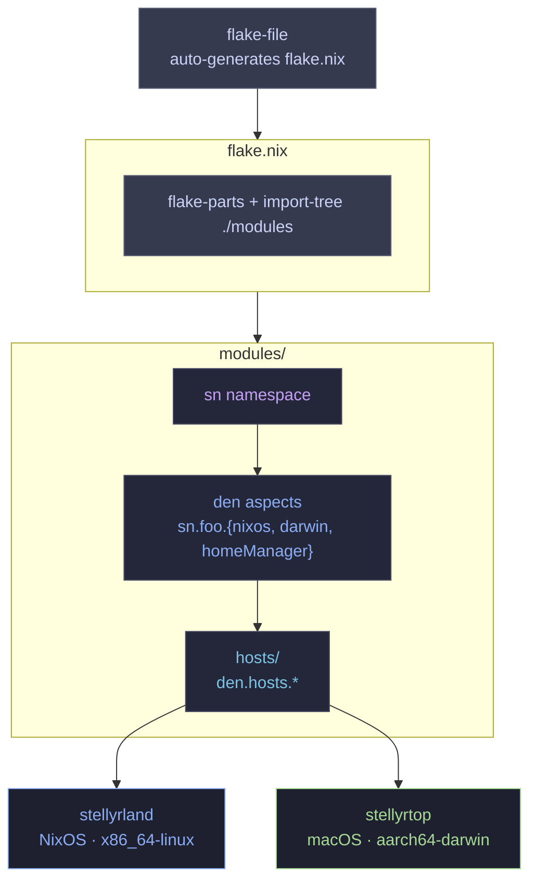

<p align="center">
  <br/>
  
</p>

<p align="center">
  &nbsp;
  &nbsp;
  
  <br/>
  &nbsp;
  &nbsp;
  &nbsp;
</p>

---

This is my personal configuration for my systems, managed by the nix language and the lix package manager.
I stick to the dendritic style, making use of the Den framework from Vic.
Documentation will explain all concepts I use here.
I use this to tinker, deploy, and manage my computers from home and remote. :)

<table align="center">
  <tr>
    <td colspan="2" align="center">
      
    </td>
  </tr>
  <tr>
    <td align="center" width="50%">
      
    </td>
    <td align="center" width="50%">
      
    </td>
  </tr>
  <tr>
    <td align="center">
      
    </td>
    <td align="center">
      
    </td>
  </tr>
</table>

> **Note:**<br>
> This is a personal configuration. This is not meant to be forked or used by others.

<p align="center"><strong>DOCUMENTATION</strong></p>
<p align="center">
  <a href="./docs/concepts.md">CONCEPTS</a> &nbsp;&bull;&nbsp;
  <a href="./docs/">GENERAL</a> &nbsp;&bull;&nbsp;
  <a href="./docs/troubleshooting/">DEBUG</a>
</p>

## 🏗️ Architecture



## 📂 Project Structure

```text
.
├── flake.nix               # Auto-generated by flake-file; entry point via import-tree
├── flake.lock              # Flake input lockfile
├── docs/                   # Documentation and troubleshooting
├── secrets/                # sops-nix encrypted secrets
│   └── secrets.yaml
└── modules/                # All aspects, auto-loaded by import-tree
    ├── flake-config.nix    # Flake inputs, target systems, flake-file declarations
    ├── namespace.nix       # Registers the sn local namespace
    ├── schema.nix          # Typed host options and Home Manager defaults
    ├── treefmt.nix         # Repo-wide formatter config
    ├── devshell.nix        # Dev shell: treefmt + write-tack app
    ├── hosts/              # Host declarations and host-specific aspect overrides
    │   ├── stellyrland.nix # NixOS workstation host entity (x86_64-linux)
    │   ├── stellyrtop.nix  # macOS MacBook host entity (aarch64-darwin)
    │   ├── stellyrland/    # Hardware config and host aspect composition
    │   └── stellyrtop/
    ├── users/              # User aspect definitions
    ├── nix-base/           # Lix, Nix settings, shell helpers, nh integration
    ├── linux-boot/         # UKI, Secure Boot, kernel, initrd ZFS rollback
    ├── linux-hardware/     # Hardware-specific configuration
    ├── linux-storage/      # ZFS datasets, preservation, Sanoid snapshots
    ├── desktop/            # Hyprland, Noctalia, theming, Flatpak, Nautilus
    │   ├── hyprland/       # Hyprland config, binds, animations, rules, cursor
    │   └── noctalia/       # Noctalia shell and greeter
    ├── terminal/           # CLI tools (bat, eza, fzf, direnv, zoxide)
    │   └── zsh/            # Zsh config, completion, syntax highlighting
    ├── dev/                # Zed, Helix, AI tools, Git, dev packages
    ├── gaming/             # Gamescope, HDR, game launchers
    ├── av/                 # GPU Screen Recorder, media players
    ├── communication/      # Messaging apps
    ├── productivity/       # Office, finance, writing, school, VMs, cloud storage
    ├── system/             # Users, secrets, services, XDG, CoolerControl, LACT
    └── openrgb/            # Peripheral RGB control
```

## ✨ Notable Configurations
- **Zero-Boilerplate Imports:** All modules under `modules/` are auto-loaded by `import-tree` — no explicit imports needed anywhere in the config.
- **BORE Scheduler:** CachyOS kernel with BORE scheduling.
  Optimized for the X3D CPU — smarter about which workloads get the extra cache vs extra clock.
- **Smart Cleanup:** `nh` configured to strictly retain the last 20 generations.
  Keeps the system version-controlled with multiple rollback points.
- **ZFS Preservation + Sanoid Snapshots:** Root and home roll back to blank ZFS snapshots on every boot; `/persist` survives. Sanoid manages daily snapshots of home and persist, with automated post-rebuild snapshots and monthly pool scrubs.

## 🛠️ Specifications
- **Architecture:** Dendritic (Keeps things separate and maintainable as aspects that can be toggled.)
- **Framework:** Den (Aspect-oriented framework built on flake-parts for cross-platform module composition.)
- **OS:** NixOS (Unstable) & macOS (Darwin)
- **Package Manager:** Lix (Community-created Nix variant)
- **WM:** Hyprland
- **Shell:** Zsh
- **Editor:** Zed / Helix
- **Terminal:** Kitty
- **Bar/Shell:** Noctalia Shell

## 💻 Hardware

### 🖥️ Stellyrland (Workstation)
- **CPU:** AMD Ryzen 9 9950X3D
- **GPU:** AMD Radeon 7900XTX 24GB (Tuned)
- **Architecture:** x86_64
- **Memory:** 64GB DDR5
- **Storage:** 4.5TB
- **OS:** NixOS

### 💻 Stellyrtop (MacBook)
- **CPU:** Apple M4
- **Architecture:** aarch64-darwin
- **Memory:** 16GB Unified
- **Storage:** 512GB
- **OS:** macOS (nix-darwin)

## ⚠️ AI Disclaimer
AI is utilized in the development of this system, largely for learning, review, and debugging.
I'm still actively learning Nix!
More elaboration on my AI morals [here](./docs/ai.md).

## 📜 Credits & Inspiration
- **[Vic](https://github.com/vic):** For creating Den and flake-file — the pattern and framework this config is built on.
- **Vimjoyer:** For inspiring my adoption of the dendritic pattern.
- **[Hand7s](https://github.com/s0me1newithhand7s):** For inspiring many features I adopted.
