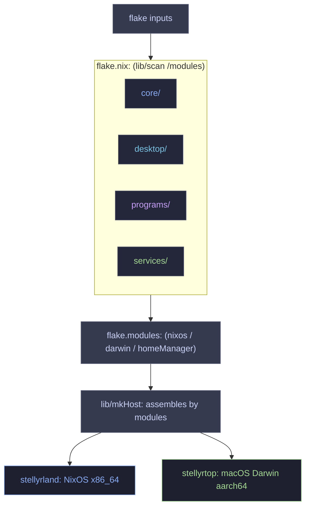

<p align="center">
  <br/>
  
</p>

<p align="center">
  &nbsp;
  &nbsp;
  
  <br/>
  &nbsp;
  &nbsp;
  
</p>

---

This is my personal configuration for my systems, managed by the nix language and its package manager.
I stick to the dendritic style. Documentation will explain all concepts I use here.
I use this to tinker, deploy, and manage my computers from home and remote. :)

<table align="center">
  <tr>
    <td colspan="2" align="center">
      
    </td>
  </tr>
  <tr>
    <td align="center" width="50%">
      
    </td>
    <td align="center" width="50%">
      
    </td>
  </tr>
  <tr>
    <td align="center">
      
    </td>
    <td align="center">
      
    </td>
  </tr>
</table>

> **Note:**<br>
> This is a personal configuration. This is not meant to be forked or used by others.

<p align="center"><strong>DOCUMENTATION</strong></p>
<p align="center">
  <a href="./docs/concepts.md">CONCEPTS</a> &nbsp;&bull;&nbsp;
  <a href="./docs/">GENERAL</a> &nbsp;&bull;&nbsp;
  <a href="./docs/troubleshooting/">DEBUG</a>
</p>

## 🏗️ Architecture



## 📂 Project Structure

```text
.
├── flake.nix               # Flake entry point using flake-parts & dynamic scanning
├── flake.lock              # Lockfile for flake inputs
├── docs/                   # System documentation & troubleshooting guides
│   └── troubleshooting/    # Troubleshooting articles (Boot loss, GPU, etc.)
├── lib/                    # Custom Nix helpers
│   └── default.nix         # Dendritic scan engine & dynamic host builder (mkHost)
├── secrets/                # Encrypted SOPS credentials & repository secrets
│   └── secrets.yaml
└── modules/                # All modular NixOS, Darwin & Home Manager aspects
    ├── flake-config.nix    # Target architectures and flake system configuration
    ├── meta.nix            # Global identity & host options schema definitions
    ├── treefmt.nix         # Repository-wide formatting rules orchestration
    ├── hosts/              # Target machine specifications & environment profiles
    │   ├── stellyrland.nix # NixOS Workstation configuration (AMD Ryzen 9/7900XTX)
    │   ├── stellyrtop.nix  # macOS MacBook Pro configuration (Apple M4)
    │   └── stellyrland/    # Workstation local hardware configurations & mounts
    ├── core/               # Hardwired base system settings & foundational options
    │   ├── boot/           # UKI generation, kernel params, Secure Boot & headless ports
    │   ├── hardware/       # Btrfs snapper mounts, HDD preservation & extra disks
    │   ├── secrets/        # SOPS secrets decryption configurations
    │   └── *.nix           # Networking, fonts, Homebrew, OOMD, base services, users & builder
    ├── desktop/            # Graphical window managers & desktop UI components
    │   ├── hyprland/       # Hyprland tiling window manager keybinds & rules
    │   └── *.nix           # Aerospace tiling config, styling tokens & custom aesthetic modules
    ├── programs/           # Feature toggle aspects (CLI & TUI applications)
    │   ├── zsh/            # Interactive shells and Powerlevel10k configurations
    │   ├── dev/            # Developer tools (Zed, Nixvim, CLI tools, Git, yazi, etc.)
    │   ├── media/          # Audio engine (Pipewire), Cava, screen recorders & editing apps
    │   ├── productivity/   # School, writing, finance, cloud storage, VM configurations
    │   └── *.nix           # Browser profiles (Zen Browser & general configurations)
    └── services/           # Background daemons & external service modules
        ├── openrgb/        # Peripheral lighting controller setups
        └── *.nix           # Coolercontrol, flatpaks, greetd, openssh, AMD LACT & AI companion
```

## ✨ Notable Configurations
- **Zero-Boilerplate Imports:** Modules are automatically discovered via a recursive scanner in `lib/`.
  This recursively scans the configuration folder for modules without having to explicitly import anything in said configs. Things are detected automatically.
- **BORE Scheduler:** Optimized CPU scheduling.
  Perfect for my X3D CPU, making it smarter on what gets the extra cache and what gets the extra clock speeds.
- **Smart Cleanup:** `nh` configured to strictly retain the last 20 generations.
  Keeps my system version controlled and gives me multiple rollback points.
- **Btrfs Snapshots + Scrubber:** Integrated `snapper` with automated pre-rebuild hooks.
  Maintainable filesystems and snapshots to return my home folder to previous states if I must roll back file changes.

## 🛠️ Main Aspects Involved
- **Architecture:** Dendritic (Keeps things separate and maintainable as aspects that can be toggled.)
- **Framework:** `flake-parts` (Allows version control and using defined inputs.)
- **OS:** NixOS (Unstable) & macOS (Darwin)
- **WM:** Hyprland
- **Shell:** Zsh
- **Editor:** Zed / Nixvim
- **Terminal:** Kitty
- **Bar/Shell:** Noctalia Shell

## 💻 Hardware

### 🖥️ Stellyrland (Workstation)
- **CPU:** AMD Ryzen 9 9950X3D
- **GPU:** AMD Radeon 7900XTX 24GB (Tuned)
- **Architecture:** x86_64
- **Memory:** 64GB DDR5
- **Storage:** 4.5TB
- **OS:** NixOS

### 💻 Stellyrtop (MacBook)
- **CPU:** Apple M4
- **Architecture:** aarch64-darwin
- **Memory:** 16GB Unified
- **Storage:** 512GB
- **OS:** macOS (nix-darwin)

## ⚠️ AI Disclaimer
AI is utilized in the development of this system, largely for review and debugging.
More elaboration on my AI morals [here](./docs/ai.md).

## 📜 Credits & Inspiration
- **Vimjoyer:** For popularizing the Dendritic pattern.
- [Hand7s](https://github.com/s0me1newithhand7s) For inspiring many features I adopted.
- [Noctalia Dev](https://github.com/noctalia-dev) for the shell components.
