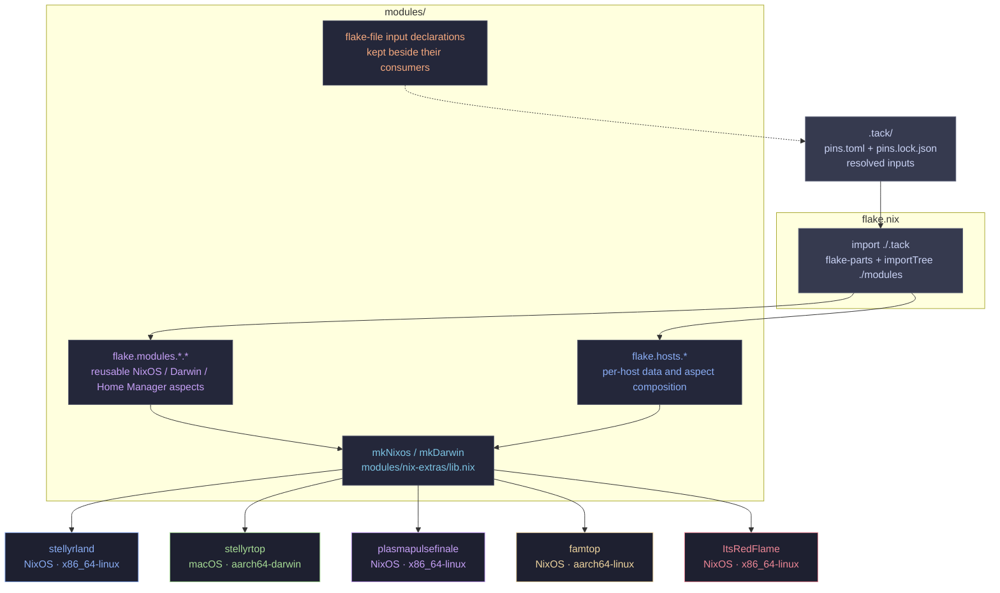

<p align="center">
  <br/>
  
</p>

<p align="center">
  &nbsp;
  &nbsp;
  
  <br/>
  &nbsp;
  &nbsp;
  &nbsp;
</p>

---

This is my personal configuration for my systems, managed by the nix language
and the lix package manager. I stick to the dendritic pattern, making use of
flake-parts. Documentation will explain all concepts I use here. I use this to
tinker, deploy, and manage my computers from home and remote. :)

My personal workstation is **Stellyrland**, most topics here will revolve around
that host.

<table align="center">
  <tr>
    <td colspan="2" align="center">
      
    </td>
  </tr>
  <tr>
    <td align="center" width="50%">
      
    </td>
    <td align="center" width="50%">
      
    </td>
  </tr>
  <tr>
    <td align="center">
      
    </td>
    <td align="center">
      
    </td>
  </tr>
</table>

> **Note:**<br> This is a personal configuration. This is not meant to be forked
> or used by others.

<p align="center"><strong>DOCUMENTATION</strong></p>
<p align="center">
  <a href="./docs/concepts.md">CONCEPTS</a> &nbsp;&bull;&nbsp;
  <a href="./docs/">GENERAL</a> &nbsp;&bull;&nbsp;
  <a href="./docs/troubleshooting/">DEBUG</a>
</p>

## 🏗️ Architecture


```mermaid
flowchart TD
    TACK[".tack/\npins.toml + pins.lock.json\nresolved inputs"]

    subgraph FLAKE["flake.nix"]
        IT["import ./.tack\nflake-parts + importTree ./modules"]
    end

    subgraph MODS["modules/"]
        DECL["flake-file input declarations\nkept beside their consumers"]
        AGG["flake.modules.*.*\nreusable NixOS / Darwin / Home Manager aspects"]
        HOSTDATA["flake.hosts.*\nper-host data and aspect composition"]
        MK["mkNixos / mkDarwin\nmodules/nix-extras/lib.nix"]
    end

    DECL -.-> TACK
    TACK --> IT
    IT --> AGG
    IT --> HOSTDATA
    AGG --> MK
    HOSTDATA --> MK
    MK --> SL["stellyrland\nNixOS · x86_64-linux"]
    MK --> ST["stellyrtop\nmacOS · aarch64-darwin"]
    MK --> PPF["plasmapulsefinale\nNixOS · x86_64-linux"]
    MK --> FT["famtop\nNixOS · aarch64-linux"]
    MK --> IRF["ItsRedFlame\nNixOS · x86_64-linux"]

    style TACK fill:#363a4f,color:#cad3f5,stroke:#5b6078
    style IT fill:#363a4f,color:#cad3f5,stroke:#5b6078
    style DECL fill:#24273a,color:#f5a97f,stroke:#494d64
    style AGG fill:#24273a,color:#c6a0f6,stroke:#494d64
    style HOSTDATA fill:#24273a,color:#8aadf4,stroke:#494d64
    style MK fill:#24273a,color:#7dc4e4,stroke:#494d64
    style SL fill:#1e2030,color:#8aadf4,stroke:#8aadf4
    style ST fill:#1e2030,color:#a6da95,stroke:#a6da95
    style PPF fill:#1e2030,color:#c6a0f6,stroke:#c6a0f6
    style FT fill:#1e2030,color:#eed49f,stroke:#eed49f
    style IRF fill:#1e2030,color:#ed8796,stroke:#ed8796
```

## 📂 Project Structure

```text
.
├── flake.nix                 # Thin entry point: imports Tack inputs + importTree ./modules
├── .tack/                    # Tack input declarations and resolved pin lock
│   ├── default.nix
│   ├── pins.toml
│   └── pins.lock.json
├── docs/                     # Concepts, workflow notes, and troubleshooting
├── secrets/                  # sops-nix encrypted secrets
│   ├── secrets.yaml
│   ├── plasmapulsefinale.yaml
│   ├── famtop.yaml
│   └── ItsRedFlame.yaml
└── modules/                  # Flake-parts modules auto-loaded by importTree
    ├── flake-config.nix      # Flake inputs, Tack/flake-file setup, supported systems
    ├── flake-options.nix     # flake.hosts / flake.lib / flake.factory option declarations
    ├── constants.nix         # Shared defaults merged into every host's `host.*`
    ├── treefmt.nix           # Repo-wide formatter configuration
    ├── devshell.nix          # Development shell and write-tack app
    ├── ai/                   # Declarative Stellxie/Hermes Agent configuration
    │   ├── default.nix       # Home Manager module, package, config, services
    │   └── _*.nix            # Explicitly imported helpers (theme, fetching, Discord)
    ├── factory/              # factory.user: per-user NixOS/Darwin/Home Manager wiring
    ├── hosts/                # Host declarations and host-specific aspect composition
    │   ├── stellyrland/      # NixOS workstation (x86_64-linux)
    │   ├── stellyrtop/       # macOS MacBook (aarch64-darwin)
    │   ├── plasmapulsefinale/ # NixOS desktop (x86_64-linux)
    │   ├── famtop/           # NixOS family desktop, Apple Silicon (aarch64-linux)
    │   └── ItsRedFlame/      # NixOS gaming/AV box (x86_64-linux)
    ├── users/                # Shared user aspect definitions
    ├── base/                 # Core, Lix, Nix settings, SSH, Tailscale, SOPS, users
    ├── nix-extras/           # Home Manager wiring, operational helpers, mkNixos/mkDarwin
    ├── linux-boot/           # UKI, Secure Boot, kernel, initrd ZFS rollback
    ├── linux-hardware/       # Asahi, firmware, GPU, and performance configuration
    ├── linux-storage/        # Disko, ZFS datasets/preservation, Sanoid/Syncoid
    ├── desktop/              # Hyprland, Noctalia, Catppuccin, Plasma, GNOME, audio
    │   ├── hyprland/         # Hyprland bindings, animations, rules, cursor, overview
    │   └── noctalia/         # Noctalia shell, lockscreen, and greeter
    ├── terminal/             # CLI tools, Kitty, and Zsh configuration
    │   └── zsh/              # Zsh completion, syntax highlighting, and prompt
    ├── dev/                  # Neovim IDE/writing, Zed, OpenCode, Git, dev tools
    ├── gaming/               # Gamescope, HDR, launchers, Steam, VR, Roblox
    ├── av/                   # Recording, editing, playback, music, and audio effects
    ├── communication/        # Discord and music RPC
    ├── applications/         # Browsers, office, finance, school, VMs, cloud storage
    ├── system/               # Darwin, Homebrew, MIME, XDG, service, and secret definitions
    └── openrgb/              # Peripheral RGB control
```

## ✨ Notable Configurations

- **Local, Locked Inputs:** `flake-file` declarations live with the modules that
  own them; Tack resolves and locks them in `.tack/pins.toml` and
  `.tack/pins.lock.json`. Keeps things truly modular and self-sustaining.
- **Zero-Boilerplate Imports:** The thin `flake.nix` recursively auto-imports
  each non-underscore `.nix` file under `modules/` as a flake-parts module.
  Underscore helpers remain explicit imports owned by their parent module.
- **Multi-System Outputs:** Per-system formatter, development-shell, and check
  outputs cover x86_64 Linux, aarch64 Linux, and aarch64 Darwin.
- **BORE Scheduler:** CachyOS kernel with BORE scheduling. Optimized for the X3D
  CPU. It's smarter about which workloads get the extra cache vs extra clock.
- **ZFS Preservation + Sanoid Snapshots:** Every boot rolls back to a blank
  snapshot, keeping the system declared as configured in preservation.nix.
  Snapshots are taken daily.
- **Boot Security:** Secure boot, LUKS encryption, initrd ZFS rollback
  functionality. Only trusted hardware may access my things.

## 🛠️ Specifications

- **Architecture:** Dendritic (Keeps things separate and maintainable as aspects
  that can be toggled.)
- **Framework:** Flake-Parts
- **OS:** NixOS (Unstable) & macOS (Darwin)
- **Package Manager:** Lix (Community-created Nix variant)
- **WM:** Hyprland
- **Shell:** Zsh
- **Editor:** Neovim (NVF IDE + writing), Zed
- **Terminal:** Kitty
- **Bar/Shell:** Noctalia

## ⚠️ AI Disclaimer

AI is utilized in the development of this system, largely for learning, review,
and debugging. I'm still actively learning Nix! More elaboration on my AI morals
[here](./docs/ai.md).

## 🐇 Personal AI

I have my own personal assistant, Stellxie. You will see her assist me with
commits and audits from time to time.

## 💻 Hosts

### 🖥️ Stellyrland (Workstation)

- CPU: AMD Ryzen 9 9950X3D
- GPU: AMD Radeon 7900 XTX 24 GB
- Architecture: x86_64-linux
- Memory: 64 GB DDR5
- Storage: 4.5 TB
- OS: NixOS

### 💻 Stellyrtop (Personal MacBook)

- CPU: Apple M4
- Architecture: aarch64-darwin
- Memory: 16 GB Unified
- Storage: 512 GB
- OS: macOS (nix-darwin)

### 🖥️ Plasmapulsefinale (Sibling Laptop)

- Architecture: x86_64-linux
- OS: NixOS

### 💻 Famtop (Apple Silicon Family Desktop)

- CPU: Apple M1
- Architecture: aarch64-linux
- Memory: 8 GB Unified
- Storage: 256 GB
- OS: NixOS
- Hardware: Apple Macbook Air

### 🖥️ ItsRedFlame (Sibling Laptop)

- Architecture: x86_64-linux
- OS: NixOS

## 📜 Credits & Inspiration

- **[Vic](https://github.com/vic):** for Flake-File.
- **Vimjoyer:** For inspiring my adoption of the dendritic pattern.
- **[Hand7s](https://github.com/s0me1newithhand7s):** For inspiring many
  features I adopted.
- **[Doc-Steve](https://github.com/Doc-Steve/dendritic-design-with-flake-parts):**
  For the repo this configuration references architecturally.
