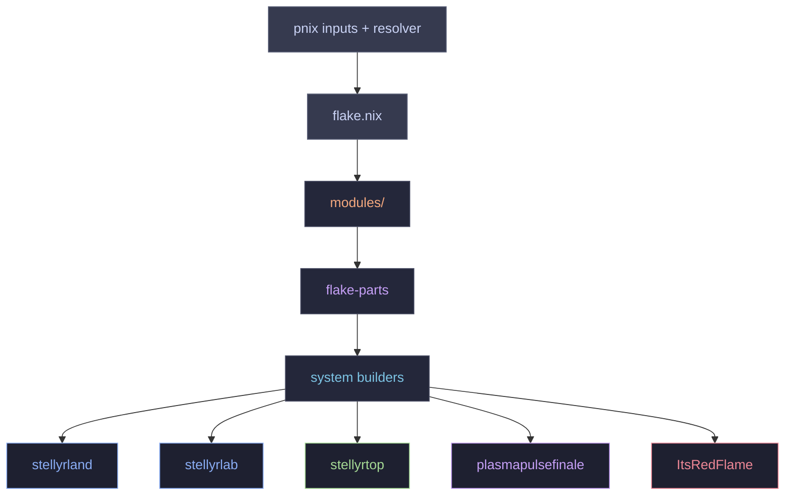

<p align="center">
  <br/>
  
</p>

<p align="center">
  &nbsp;
  &nbsp;
  
  <br/>
  &nbsp;
  &nbsp;
  &nbsp;
</p>

---

This is my personal configuration for my systems, managed by the nix language
and the lix package manager. I stick to the dendritic pattern. Documentation will explain all concepts I use here. I use this to tinker, deploy, and manage my computers from home and remote. :)

My personal workstation is **Stellyrland**, most topics here will revolve around
that host.

<table align="center">
  <tr>
    <td colspan="2" align="center">
      
    </td>
  </tr>
  <tr>
    <td align="center" width="50%">
      
    </td>
    <td align="center" width="50%">
      
    </td>
  </tr>
  <tr>
    <td align="center">
      
    </td>
    <td align="center">
      
    </td>
  </tr>
</table>

> **Note:**<br> This is a personal configuration. This is not meant to be forked
> or used by others.

<p align="center"><strong>DOCUMENTATION</strong></p>
<p align="center">
  <a href="https://github.com/iStellanova/Stellyrland/blob/assets/docs/concepts.md">CONCEPTS</a> &nbsp;&bull;&nbsp;
  <a href="https://github.com/iStellanova/Stellyrland/tree/assets/docs">GENERAL</a> &nbsp;&bull;&nbsp;
  <a href="https://github.com/iStellanova/Stellyrland/tree/assets/docs/troubleshooting">DEBUG</a>
</p>

## 🏗️ Architecture


```mermaid
flowchart TD
    PNIX["pnix inputs + resolver"] --> FLAKE["flake.nix"]
    FLAKE --> MODULES["modules/"]
    MODULES --> PARTS["flake-parts"]
    PARTS --> BUILD["system builders"]

    BUILD --> STELLYRLAND["stellyrland"]
    BUILD --> STELLYRLAB["stellyrlab"]
    BUILD --> STELLYRTOP["stellyrtop"]
    BUILD --> PLASMA["plasmapulsefinale"]
    BUILD --> REDFLAME["ItsRedFlame"]

    style PNIX fill:#363a4f,color:#cad3f5,stroke:#5b6078
    style FLAKE fill:#363a4f,color:#cad3f5,stroke:#5b6078
    style MODULES fill:#24273a,color:#f5a97f,stroke:#494d64
    style PARTS fill:#24273a,color:#c6a0f6,stroke:#494d64
    style BUILD fill:#24273a,color:#7dc4e4,stroke:#494d64
    style STELLYRLAND fill:#1e2030,color:#8aadf4,stroke:#8aadf4
    style STELLYRLAB fill:#1e2030,color:#8aadf4,stroke:#8aadf4
    style STELLYRTOP fill:#1e2030,color:#a6da95,stroke:#a6da95
    style PLASMA fill:#1e2030,color:#c6a0f6,stroke:#c6a0f6
    style REDFLAME fill:#1e2030,color:#ed8796,stroke:#ed8796
```

## 📂 Project Structure

```text
.
├── .pnix/                    # Resolver and locked input definitions
├── flake.nix                 # Flake entry point and module tree loader
├── secrets/                  # Encrypted nix-secrets inputs
├── modules/                  # Feature modules
│   ├── ai/                   # Hermes and personal AI configuration
│   ├── applications/         # User-facing applications, grouped by domain
│   │   ├── communication/
│   │   ├── development/
│   │   ├── file-manager/
│   │   ├── gaming/
│   │   └── media/
│   ├── base/                 # Core system services and shared settings
│   ├── desktop/              # Desktop environments, compositors, and themes
│   ├── factory/              # Per-user NixOS/Darwin/Home Manager wiring
│   ├── hosts/                # Host declarations and host-specific configuration
│   │   ├── ItsRedFlame/
│   │   ├── plasmapulsefinale/
│   │   ├── stellyrlab/
│   │   ├── stellyrland/
│   │   └── stellyrtop/
│   ├── linux/                # Linux boot and storage configuration
│   ├── nix/                  # Nix, Home Manager, caches, and helpers
│   ├── pins.nix              # Input declarations owned by this configuration
│   ├── system/               # System services, desktop integration, and theming
│   ├── terminal/             # Shell, CLI, Kitty, and terminal utilities
│   ├── treefmt.nix           # Repo-wide formatter configuration
│   └── users/                # Shared user aspect definitions
├── LICENSE
└── README.md
```

## ✨ Notable Configurations

- **Decentralized Inputs:** pnix allows me to declare inputs in module files, eliminating a monolithic flake.nix.
- **Zero-Boilerplate Imports:** `flake.nix` locally loads non-underscore `.nix`
  files under `modules/` as flake-parts modules.
- **Multi-System Outputs:** Per-system formatter and check outputs cover x86_64
  Linux and aarch64 Darwin.
- **BORE Scheduler:** CachyOS kernel with BORE scheduling. Optimized for the X3D
  CPU. It's smarter about which workloads get the extra cache vs extra clock.
- **ZFS Preservation + Sanoid Snapshots:** Every boot rolls back to a blank
  snapshot, keeping the system declared as configured in preservation.nix.
  Snapshots are taken daily.
- **Boot Security:** Secure boot, LUKS encryption, initrd ZFS rollback
  functionality. Only trusted hardware may access my things.

## 🛠️ Specifications

- **Architecture:** Dendritic (Keeps things separate and maintainable as aspects
  that can be toggled.)
- **Framework:** Flake-Parts
- **OS:** NixOS (Unstable) & macOS (Darwin)
- **Package Manager:** Lix (Community-created Nix variant)
- **WM:** Hyprland
- **Shell:** Zsh
- **Editor:** Neovim (NVF IDE + writing), Zed
- **Terminal:** Kitty
- **Bar/Shell:** Noctalia

## ⚠️ AI Disclaimer

AI code is utilized in the development of this system, largely for learning, review, and debugging. I'm still actively learning Nix! More elaboration on my AI morals
[here](https://github.com/iStellanova/Stellyrland/blob/assets/docs/ai.md).

## 🐇 Personal AI

I have my own personal assistant, Stellxie. You will see her assist me with
commits and audits from time to time.

## 💻 Hosts

### 🖥️ Stellyrland (Workstation)

- CPU: AMD Ryzen 9 9950X3D
- GPU: AMD Radeon 7900 XTX 24 GB
- Architecture: x86_64-linux
- Memory: 64 GB DDR5
- Storage: 4.5 TB
- OS: NixOS

### 🖥️ Stellyrlab (Homelab)

- CPU: Intel Core i7 8700K
- Architecture: x86_64-linux
- Memory: 16 GB DDR4
- Storage: 256 GB
- OS: NixOS

### 💻 Stellyrtop (Personal MacBook)

- CPU: Apple M4
- Architecture: aarch64-darwin
- Memory: 16 GB Unified
- Storage: 512 GB
- OS: macOS (nix-darwin)

### 🖥️ Plasmapulsefinale (Sibling Laptop)

- Architecture: x86_64-linux
- OS: NixOS

### 🖥️ ItsRedFlame (Sibling Laptop)

- Architecture: x86_64-linux
- OS: NixOS

## 📜 Credits & Inspiration

- **Vimjoyer:** For inspiring my adoption of the dendritic pattern.
- **[Hand7s](https://github.com/s0me1newithhand7s):** For inspiring many
  features I adopted.
- **Bunny Systems:** For resources like pnix. :stupid_cat:
